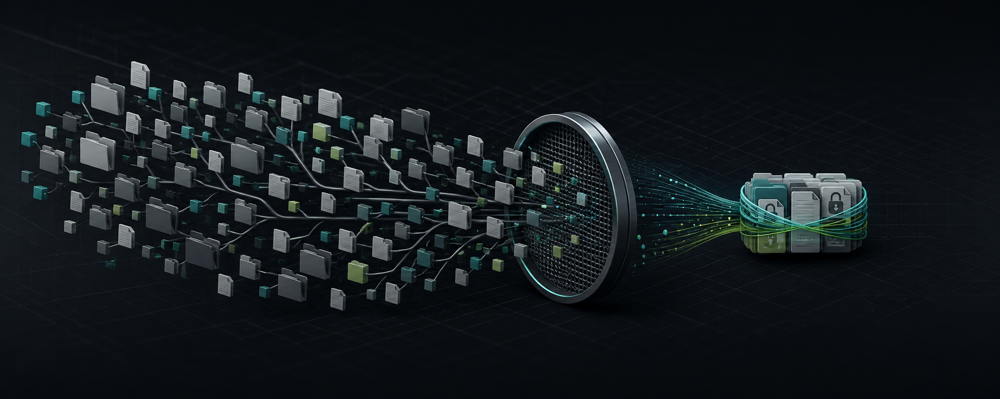
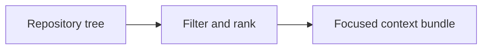

<!-- readme-refresh:start -->
<p align="center">
  <picture>
    <source media="(prefers-color-scheme: dark)" srcset="assets/readme-banner.png">
    <source media="(prefers-color-scheme: light)" srcset="assets/readme-banner.png">
    
  </picture>
</p>

<h1 align="center">🧺 ContextSieve</h1>

<p align="center"><strong>Turn a repository into focused, secret-aware context for coding agents.</strong></p>

<p align="center">
  <a href="https://github.com/al1re3a/contextsieve/actions/workflows/ci.yml"></a>
  <a href="https://nodejs.org/"></a>
  <a href="LICENSE"></a>
  <a href="https://github.com/al1re3a/contextsieve/stargazers"></a>
  <a href="https://github.com/al1re3a/contextsieve/issues"></a>
</p>

<p align="center">
  <a href="https://github.com/al1re3a/contextsieve"></a>
  <a href="#usage"></a>
  <a href="CONTRIBUTING.md"></a>
  <a href="SECURITY.md"></a>
</p>

<p align="center">
  
</p>

> [!NOTE]
> Secret filtering is a defensive layer, not a guarantee. Review generated context before sending it to another service.

## 📑 Contents

- [At a glance](#-at-a-glance)
- [Why](#why)
- [Features](#features)
- [Usage](#usage)
- [API](#api)
- [Development](#development)
- [Roadmap](#roadmap)

---

## 🔎 At a glance

| | |
|---|---|
| **Purpose** | Turn any repository into focused, secret-safe context for coding agents and LLMs. |
| **Input** | Repository tree |
| **Output** | Focused context bundle |
| **Runtime** | Node.js 20+ |
| **CI** | ✅ Linux |
| **Status** | ✅ Maintained |

<details>
<summary><strong>🧭 How it works</strong></summary>



</details>

<details>
<summary><strong>📁 Repository layout</strong></summary>

```text
contextsieve/
├── .github/
├── src/
├── test/
├── package.json
└── README.md
```

</details>

<details>
<summary><strong>🤝 Contributors</strong></summary>

<br>
<a href="https://github.com/al1re3a/contextsieve/graphs/contributors">
  
</a>

</details>
<!-- readme-refresh:end -->

**Give AI the files it needs — not your whole repository.**

ContextSieve is a zero-dependency CLI that ranks repository files for a task, fits the best ones inside a token budget, and redacts common secrets before producing Markdown, XML, or JSON.

```bash
npx contextsieve . --query "fix OAuth callback loop" --budget 12000 -o context.md
```

## Why

Dumping an entire repository into an agent is slow, expensive, and risky. ContextSieve uses a deterministic relevance score based on filenames, project structure, task terms, tests, and manifests. The output is reproducible and inspectable—no model or API key required.

## Features

- Task-aware file ranking
- Hard approximate token ceiling
- Secret redaction on by default
- `.gitignore` plus custom ignore patterns
- Markdown, XML, and JSON output
- Binary and oversized-file detection
- Works offline with zero runtime dependencies

## Usage

```bash
# Pipe context into another tool
contextsieve ./my-app -q "trace checkout failures" | your-llm-cli

# XML is convenient for models that understand tagged context
contextsieve . -q "review database migrations" -f xml -b 24000

# Add project-specific exclusions
contextsieve . --ignore fixtures --ignore "*.generated.ts"
```

Secret redaction catches common API keys, GitHub tokens, AWS access keys, bearer credentials, and credential-like assignments. It is a safety net, not a guarantee—always inspect context before sharing it.

## API

```js
import { buildBundle } from 'contextsieve';

const { text, files, metadata } = await buildBundle({
  root: '.',
  query: 'add rate limiting',
  budget: 16_000,
  format: 'markdown'
});
```

## Development

```bash
npm test
npm run check
```

## Roadmap

- AST-aware symbol extraction
- Git-diff relevance boost
- Language-specific compactors
- Editor extensions

Contributions and real-world ranking examples are welcome. See [CONTRIBUTING.md](CONTRIBUTING.md).

## License

MIT
